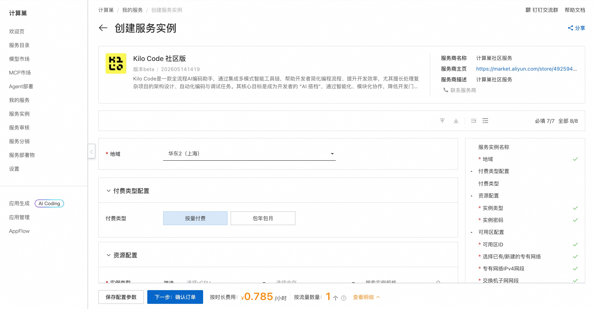
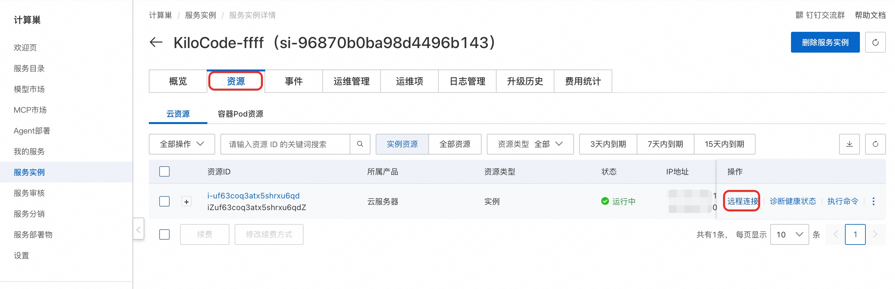
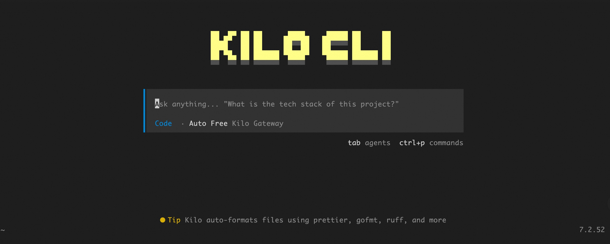

## KiloCode 简介

KiloCode 是一个运行在终端中的高效 AI 编程助手（AI Coding Assistant），旨在为开发者提供极速的代码生成、解释和调试体验。它基于先进的大语言模型构建，能够深度集成到开发工作流中，支持实时代码补全、错误修复、单元测试生成以及复杂逻辑的重构。通过轻量级的 TUI（文本用户界面）或 CLI 交互，KiloCode 允许开发者在不离开终端的情况下完成从需求分析到代码实现的全过程，极大提升了开发效率。

### 核心特性

- **智能代码补全** — 基于上下文感知的实时代码建议，支持 Python, JavaScript, Go, Rust 等主流语言
- **自然语言编程** — 使用自然语言描述需求，自动生成可执行代码片段或完整模块
- **多模型兼容** — 支持接入 DeepSeek, Claude, GPT-4 等多种后端模型，可根据任务复杂度灵活切换
- **隐私安全优先** — 支持本地化部署模式，确保敏感代码数据不出境，保障企业级数据安全
- **Git 深度集成** — 自动生成规范的 Commit Message，辅助代码 Diff 分析，支持一键回滚更改
- **交互式代码审查** — 自动检测潜在 Bug、安全漏洞及性能瓶颈，并提供即时优化建议
- **自定义指令系统** — 允许用户定义专属的代码风格、Lint 规则和重构偏好
- **轻量级资源占用** — 针对终端环境极致优化，低内存消耗，秒级启动速度


## 部署流程

1. 单击[部署链接](https://computenest.console.aliyun.com/service/instance/create/cn-hangzhou?type=user&ServiceId=service-aff1e833a0bf4458b334)，进入服务实例部署界面，根据界面提示填写参数，可以看到对应询价明细，确认参数后点击**下一步：确认订单**。

    

2. 确认订单完成后同意服务协议并点击**立即创建**。

3. 等待部署完成后远程连接服务器。
    

4. 连接后执行以下命令启动 KiloCode 界面：
    ```shell
    sudo su root
    cd /root
    kilocode
    ```
    

## 使用指南
请查看[官方文档](https://kilo.ai/docs/getting-started)

#### 使用须知

- 本工具为第三方开源项目，阿里云仅提供云资源和部署入口支持，不对工具自身功能、生成内容、执行结果、服务可用性及额外费用承担责任。
